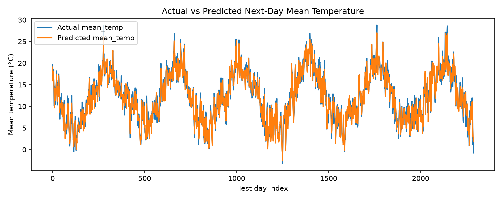

# Weather Prediction using RNN 

Predicts next-day weather (mean/max/min temperature and precipitation) for
London using an LSTM-based recurrent neural network trained on 14-day
historical weather windows.

## Dataset

[`london_weather.csv`](https://drive.google.com/file/d/1mRTi_ZiuFinPnqHpm_XFFuGUdjnY87Hq/view)
- historical daily weather recorded near Heathrow Airport, London
(1979–2020), 10 columns: `date, cloud_cover, sunshine, global_radiation,
max_temp, mean_temp, min_temp, precipitation, pressure, snow_depth`.

The raw file is not committed to this repo (keeps it lightweight). Fetch it
with:

```bash
python download_data.py
```

which saves it to `data/london_weather.csv`.

## Process

1. **Data preparation** (`train.py: load_and_clean`)
   - Parse `date`, sort chronologically.
   - Fill the small gaps in the ECA-sourced measurements with linear
     interpolation.
   - Chronological 85/15 train/test split (no shuffling, future rows never
     leak into training, and the split happens *before* scaling).
   - Features scaled to `[0, 1]` with `MinMaxScaler`, fit on the training
     split only.
2. **Sequence construction**
   - Sliding windows of the past **14 days** across all 9 features become
     the RNN input; the target is the *next* day's `mean_temp`, `max_temp`,
     `min_temp` and `precipitation`.
3. **Model** (`train.py: build_model`)
   ```
   Input(14, 9)
     -> LSTM(64, return_sequences=True) -> Dropout(0.2)
     -> LSTM(32)
     -> Dense(32, relu)
     -> Dense(4)                # mean_temp, max_temp, min_temp, precipitation
   ```
   Adam optimizer, MSE loss, MAE tracked as a metric, early stopping on
   validation loss.
4. **Evaluation & visualization**
   - MSE and MAE computed per target on the held-out test set, after
     inverse-scaling predictions back to real units (°C / mm).
   - `outputs/actual_vs_predicted.png`, actual vs. predicted next-day mean
     temperature over the test period.
   - `outputs/metrics.csv`, per-target MSE/MAE.

## Results

Test-set metrics (real units °C for temperatures, mm for precipitation):

| Target        | MSE   | MAE   |
|---------------|-------|-------|
| mean_temp     | 1.47  | 0.92  |
| max_temp      | 6.19  | 1.93  |
| min_temp      | 4.02  | 1.60  |
| precipitation | 13.56 | 2.32  |

The model predicts next-day mean temperature within about 1°C on average.
Precipitation is harder to predict, it's noisy and right-skewed (most days
are dry with occasional heavy-rain spikes), which shows up as the larger
MSE.



## Run it

```bash
pip install -r requirements.txt
python download_data.py
python train.py
```

Outputs (`outputs/weather_rnn.keras`, `outputs/metrics.csv`,
`outputs/actual_vs_predicted.png`) are written after training.

